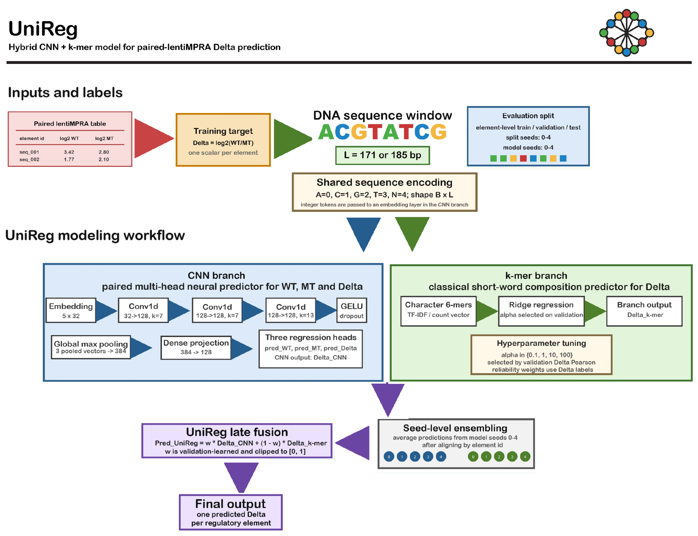

# UniReg

UniReg is an assay-aware regulatory sequence modeling workflow for paired
lentiMPRA data. The manuscript-facing UniReg model is:

```text
cnn3head_kmer_fused_ens
```

UniReg predicts the paired-lentiMPRA activity contrast:

```text
Delta = log2(WT / MT) = log2_WT - log2_MT
```

where WT denotes the integrated reporter-state activity and MT denotes the
episomal reporter-state activity. The repository is designed for
manuscript-level reproducibility of the v34 retained-model analyses, not as a
general-purpose installable Python package.



The editable/source schematic is available as
[`Docs/Unireg.pdf`](Docs/Unireg.pdf). A GitHub-friendly PNG render is stored at
[`Docs/Unireg.png`](Docs/Unireg.png). The original v3 schematic source is also
kept as [`Docs/unireg-v3.pdf`](Docs/unireg-v3.pdf).

## Model Summary

UniReg is not a single monolithic neural network. It is a validation-weighted
late-fusion ensemble of:

1. a paired three-head CNN that jointly predicts WT, MT and Delta;
2. a 6-mer k-mer ridge model that predicts Delta from short-word composition;
3. a constrained validation-set fusion of the CNN and k-mer ensemble
   predictions.

The CNN branch uses integer nucleotide tokens, an embedding layer, three 1D
convolutional layers, global max pooling, a dense projection layer and three
regression heads. The k-mer branch uses character-level 6-mer features and ridge
regression. The final UniReg prediction is:

```text
pred_UniReg = w * pred_CNN + (1 - w) * pred_kmer
```

where `w` is learned on the validation set and clipped to `[0, 1]`.

Full architecture details and implementation file locations are documented in
[`Docs/MODEL_ARCHITECTURE.md`](Docs/MODEL_ARCHITECTURE.md).

## Repository Layout

| Folder | Contents |
|---|---|
| `Code/` | Core Python and bash scripts for the retained-model benchmark. |
| `Data/` | Required raw GSE83894 and GSE142696 input files plus checksums. |
| `Results/` | Lightweight manuscript-ready summary tables from the retained 9-model package. |
| `Docs/` | Model architecture notes and UniReg schematic files. |
| `Supplementary_Material/` | Lightweight ABD extension code and summary tables. |

## Included Data

The required lightweight raw input files for the core manuscript reruns are
included:

```text
Data/raw/GSE83894/formatB_agg_only.zip
Data/raw/GSE83894/formatA_all_replicates.zip
Data/raw/GSE142696/GSM4237954_9MPRA_elements.fa.gz
Data/raw/GSE142696/GSE142696_9MPRA.ActivityRatios.tsv.gz
Data/raw/GSE142696/GSE142696_9MPRA.ActivityRatios.IndividualReps.tsv.gz
```

Checksums are stored in:

```text
Data/raw_manifest.tsv
```

The optional motif database for FIMO post hoc analyses is not included:

```text
Data/raw/motif/H14CORE_meme_format.meme
```

## Retained 9-Model Set

The v34 manuscript uses the retained main-text 9-model set only:

1. `cnn3head_kmer_fused_ens` (UniReg)
2. `cnn_delta_ens`
3. `cnn_msres_wt_mt_delta3head_ens`
4. `gkmsvm_optional`
5. `kmer_delta_ens`
6. `kmer_elasticnet_delta_ens`
7. `nt_transformer_delta_ens`
8. `kmer_nystroem_ridge_delta_ens`
9. `onehot_ridge_delta_ens`

The retained list is also stored at:

```text
Results/maintext9/mpra_maintext9_research_pkg_20260314_183510/00_manifest/models_kept_maintext9.txt
```

## Quick Start

Create the environment:

```bash
conda env create -f environment.yml
conda activate unireg
```

or install the Python dependencies manually:

```bash
python -m pip install -r requirements.txt
```

Run the primary GSE83894 paired-lentiMPRA benchmark:

```bash
cd Code
bash run_plan8_all_single_node.sh \
  --formatB_zip ../Data/raw/GSE83894/formatB_agg_only.zip \
  --formatA_zip ../Data/raw/GSE83894/formatA_all_replicates.zip \
  --out_dir ../Results/recomputed/out_plan8 \
  --split_seeds 0,1,2,3,4 \
  --model_seeds 0,1,2,3,4 \
  --loss huber \
  --delta_clip_q 0.01 \
  --jobs 8
```

Run the GSE142696 external benchmark:

```bash
cd Code
ELEMENTS_FA=../Data/raw/GSE142696/GSM4237954_9MPRA_elements.fa.gz \
MEAN_TSV=../Data/raw/GSE142696/GSE142696_9MPRA.ActivityRatios.tsv.gz \
REPS_TSV=../Data/raw/GSE142696/GSE142696_9MPRA.ActivityRatios.IndividualReps.tsv.gz \
OUT_ROOT=../Results/recomputed/out_gse142696_plan8 \
JOBS=8 \
bash 2.sh
```

## Results Included Here

This repository includes manuscript-ready lightweight result tables from the
final retained-model package, including:

- primary GSE83894 benchmark summaries;
- seven-task R-only retained-model rankings;
- GSE142696 design-by-trim retained-model summaries;
- ceiling, endpoint-gap, transfer, negative-control and trim-robustness tables;
- ABD extension summary tables for matched-library episomal assays and
  orthogonal HepG2 variant-MPRA analyses.

Full model checkpoints and complete per-element prediction matrices are not
included.

## Key Implementation Files

| Purpose | File |
|---|---|
| UniReg CNN branch | `Code/scripts/train_cnn_wt_mt_delta3head.py` |
| Shared CNN model utilities | `Code/scripts/models.py` |
| k-mer ridge branch | `Code/scripts/baseline_kmer_ridge.py` |
| Seed-level prediction ensemble | `Code/scripts/ensemble_predictions.py` |
| CNN + k-mer fusion | `Code/scripts/fuse_two_models_linear.py` |
| Primary benchmark runner | `Code/run_plan8_all_parallel.sh` |
| GSE142696 external runner | `Code/run_plan8_gse142696_parallel.sh` |
| Retained package builder | `Code/build_maintext9_research_package_v2.sh` |

## Optional Components

- `gkmsvm_optional` requires an external LS-GKM/gkm-SVM installation.
- `nt_transformer_delta_ens` requires transformer dependencies and access to the
  corresponding pretrained nucleotide-transformer resources.
- The core UniReg model does not require gkm-SVM or the transformer comparator.

## License

Code in this repository is released under the MIT License. Public datasets
included here retain their original source terms and should be cited according
to the original data providers.
